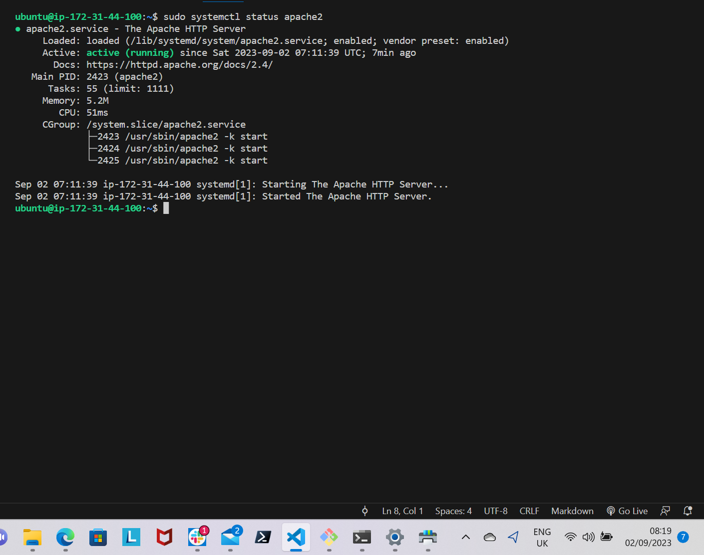

# LAMP STACK IMPLEMENTATION (Linux, Apache, MySQL and PHP)

## Requirements
- Have a Cloud Service Provider such as AWS.
- Launch an instance. It is more advisable to Choose Ubuntu as the AMI of the instance.
- Connect your instances to your virtual host through SSH.

STEP 1 - INSTALLING APACHE WEB SERVER

Install Apache using Ubuntu's package manager

```python
'apt'
```
Update a list of packages using

```python
'sudo apt update'
```


Install Apache2 package

```python
'sudo apt install apache2'
```


To confirm that apache2 is running is running as a service in your operating system use this command

```python
'sudo systemctl apache2 status'
```


To view the Apache2 default page and to confirm it is accessible through your firewall, do this:

Go to your EC2 instance, copy your public addressand paste it on your browser - ```python
'http://publicaddress'

```


STEP 2 - INSTALLING MYSQL

Use 'apt' to install Mysql server

```python
'sudo apt install mysql-server'
```


Connect to Mysql server as the administrative database user root with this command

```python
'sudo mysql'
```


Set a password for the root user using this command

```python
'ALTER USER 'root'@'localhost' IDENTIFIED WITH mysql_native_password BY 'your password';'
```

Exit the mysql server by typing 'exit'

To start the interactive script, run this command

```python
'sudo mysql_secure_installation'
```


It will ask you to VALIDATE PASSWORD PLUGIN.

After validating password, log into Mysql console by typing -

```python
'sudo mysql -p'
```


STEP 3 - INSTALLING PHP

To install php package, you'll need *php-mysql*, this is a PHP module which allows PHP to communicate with Mysql-based databases. Furthermore, you'll need *libapache2-mod-php* so at to enable Apache to handle PHP files.

To install all the 3 packages at once, run this command -

```python
'sudo apt install php libapache2-mod-php php-mysql'
```


To confirm your PHP version, run this command -

```python
'php -v'
```


STEP 4 - CREATING A VIRTUAL HOST FOR YOUR WEBSITE USING APACHE

Create a directory 'projectlamp' using *mkdir* as follows - 

```python
'sudo mkdir /var/www/projectlamp'
```

Then, assign ownership of the directory using this command

```python
'sudo chown -R $USER:$USER /var/www/projectlamp'
```

Next, create and open a new configuration file in Apache's site by using this command - 

```python
'sudo vi /etc/apache2/sites-available/projectlamp.conf'
```

A new blank file will be created, hit 'i' on the keyboard to enter insert mode and paste in the file the following bare-bone configuration - 

```python
'<VirtualHost *:80>
    ServerName projectlamp
    ServerAlias www.projectlamp 
    ServerAdmin webmaster@localhost
    DocumentRoot /var/www/projectlamp
    ErrorLog ${APACHE_LOG_DIR}/error.log
    CustomLog ${APACHE_LOG_DIR}/access.log combined
</VirtualHost>'
```

To save and close the file, hit 'esc' button and type :wq then hit enter key.

To show the new file in the sites-available directory, run 

```python
'sudo ls /etc/apache2/sites-available'
```

Use the below command to enable the new virtual host -

```python
'sudo a2ensite projectlamp'
```

To disable Apache's default website use this command -

```python
'sudo a2dissite 000-default'
```

To ensure there is no syntax error in your configuration file, run this command -

```python
'sudo apache2ctl configtest'
```

For these changes to take effect, reload Apache - 

```python
'sudo systemctl reload apache2'
```

Create an index.html file in that location to test that the virtual host is working. Run this command -

```python
'sudo echo 'Hello LAMP from hostname' $(curl -s http://169.254.169.254/latest/meta-data/public-hostname) 'with public IP' $(curl -s http://169.254.169.254/latest/meta-data/public-ipv4) > /var/www/projectlamp/index.html'
```


Finally, go to your browser and open your website URL using your IP address

